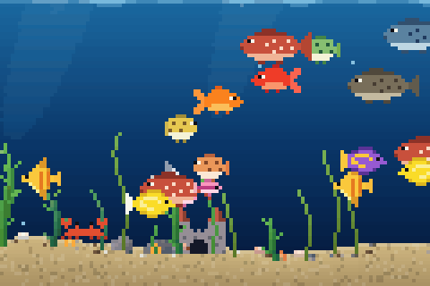
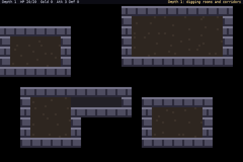
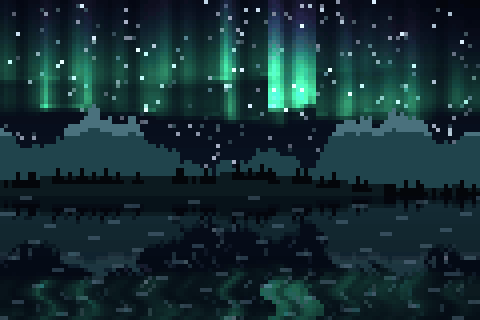
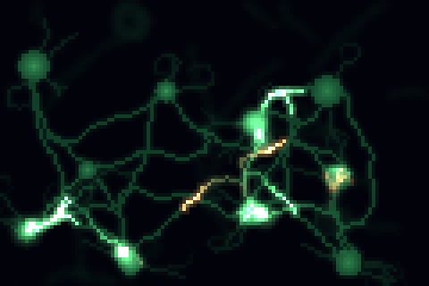
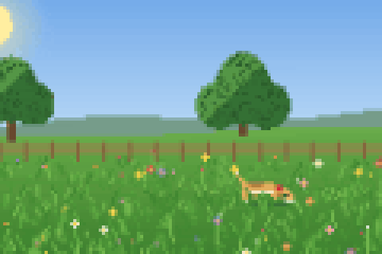
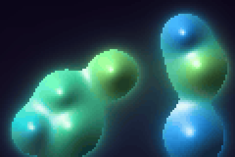
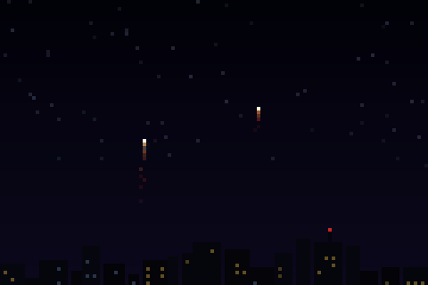
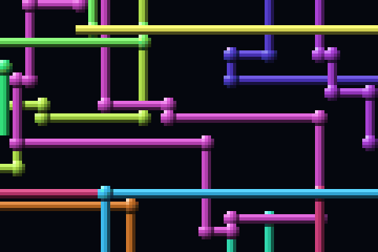

# tanim

**Endless, procedural screensaver animations for your terminal.** Twenty-seven of them, from a self-exploring roguelike dungeon to firing neurons, drawn in true color with half-block pixels, in a single native Rust binary with no dependencies beyond `libc`.

<p align="center">
  
  
</p>

```sh
tanim            # a random animation
tanim aurora     # a specific one
```

**[Try them in your browser →](https://santiagoschez.github.io/tanim/)** (the same code, compiled to WebAssembly)

- **Procedural and endless.** Nothing is pre-recorded: every run is different, and nothing repeats.
- **Two pixels per cell.** Everything is drawn with `▀` half blocks, so each terminal cell holds two square pixels in 24-bit color.
- **Light on the terminal.** Only the cells that change are sent, invisible color changes are skipped, and frames are wrapped in synchronized output, so even busy scenes stay smooth. It starts in about a millisecond.
- **Interactive.** Zoom into any animation, pan around, skip to the next one.
- **Beyond the terminal.** Export the animations as standalone web pages (the same code compiled to WebAssembly), as videos, or as looping GIF screensavers for an Elgato Stream Deck.

## Gallery

<table>
  <tr>
    <td width="50%"><br><b>aurora</b>: northern lights over mountains, mirrored in a lake</td>
    <td width="50%"><br><b>neurons</b>: spikes racing down axons and crossing synapses</td>
  </tr>
  <tr>
    <td><br><b>dog</b>: a dog running, napping and chasing butterflies through the day</td>
    <td><br><b>metaballs</b>: glossy drops of gel that bulge and merge</td>
  </tr>
  <tr>
    <td><br><b>fireworks</b>: shells bursting over a city skyline</td>
    <td><br><b>pipes</b>: the classic 3D pipes screensaver</td>
  </tr>
</table>

## Install

You need a Rust toolchain ([rustup](https://rustup.rs)).

```sh
git clone https://github.com/SantiagoSchez/tanim && cd tanim
make install                    # builds and installs ~/.local/bin/tanim
make install PREFIX=/usr/local  # or anywhere else
make uninstall
```

For the web export, also add the WebAssembly target before building: `rustup target add wasm32-unknown-unknown`. Without it, `tanim` builds and runs the same, just without `--export-html`.

tanim needs a terminal with 24-bit color: Ghostty, iTerm2, WezTerm, kitty, Alacritty, a recent Terminal.app, and most modern ones.

## Usage

```sh
tanim                   # a random animation from the catalog
tanim aquarium          # a specific one
tanim aq                # any unique prefix works
tanim --list            # the catalog
tanim --seed 42 aurora  # the exact same run every time
tanim --zoom 2 fire     # start zoomed in
tanim --opaque matrix   # paint the background instead of showing the terminal's own
tanim --export-html     # web pages in html/
```

| Key | Action |
|---|---|
| `Enter` | Switch to another random animation |
| `↑` / `↓` | Zoom in and out, up to 4x, without restarting the animation |
| `W` `A` `S` `D` | Pan while zoomed in |
| `Space` | In `dungeon`: build a new level |
| `Q`, `Esc`, `Ctrl+C` | Quit, restoring the terminal as it was |

Resizing the window restarts the animation at the new size. The animations with a plain dark background (`starfield`, `galaxy`, `matrix`, `life`, `physarum`, `neurons` and `pipes`) show the terminal's own background instead, so they sit on top of its transparency or blur. If the terminal can't keep up, tanim drops frames rather than slowing down.

## Catalog

| Animation | |
|---|---|
| `aquarium` | Pixel-art fish of seven species, a shark, crabs, bubbles and swaying seaweed |
| `garden` | Plants sprouting, branching and blooming through the seasons |
| `dog` | A dog running across a meadow, napping and chasing butterflies from dawn to night |
| `dungeon` | A roguelike level that builds itself (rooms and corridors, or caves) and a hero who explores it, fights and loots |
| `rain` | A thunderstorm with splashes, puddles and branching lightning |
| `snow` | Snow settling on pines and roofs under shifting wind |
| `ripples` | Raindrops rippling across a pond |
| `starfield` | Warp-speed flight through the stars |
| `tunnel` | Flying down an endless tiled tunnel that bends and rolls |
| `fireworks` | Rockets bursting into colored sparks over the city |
| `galaxy` | A spiral galaxy with dust lanes, slowly turning |
| `aurora` | Northern lights over mountains and a lake |
| `boids` | A flock of birds moving as one, until a hawk shows up |
| `matrix` | Cascading digital rain |
| `fire` | A roaring bonfire |
| `plasma` | Psychedelic flowing plasma |
| `lava` | A lava lamp with blobs that melt and merge |
| `metaballs` | Glossy blobs merging like drops of gel |
| `life` | Conway's Game of Life, colored by age |
| `physarum` | Slime mould growing a living transport network |
| `neurons` | Neurons under a microscope, firing in cascades across their synapses |
| `sand` | Colored sand falling into dunes |
| `maze` | A maze carving itself, then being solved |
| `snake` | Self-playing Snake |
| `tetris` | Self-playing Tetris |
| `pipes` | The classic 3D pipes screensaver |
| `city` | A night skyline scrolling by, with traffic and planes |

## On the web

```sh
tanim --export-html [dir] [names...]   # default: html/, every animation
```

The [live demo](https://santiagoschez.github.io/tanim/) is exactly this, rebuilt and published by GitHub Actions on every push. It writes `index.html`, with every animation and a picker (deep links like `index.html#aurora` work), plus one standalone page per animation. The pages run the very same Rust code compiled to WebAssembly, so they are endless, different on every load, adapt to the window and take the same keys, plus `+`/`−` for the cell size and `F` for fullscreen. Each page is self-contained (about 570 KB) and opens straight from disk, no server needed.

## Videos and Stream Deck screensavers

The script in `scripts/` records animations from `tanim --dump` and encodes them with ffmpeg. It needs Python with Pillow, numpy and fontTools, plus ffmpeg.

```sh
make videos                  # a WebM per animation in videos/ (2160x1296, VP9)
make streamdeck MODELS=neo   # looping GIF screensavers in streamdeck/neo/
python3 scripts/video.py --streamdeck all aurora dungeon
```

The Stream Deck GIFs come at each model's screensaver resolution: `neo` (480x320), `mk2` (480x272), `xl` (768x384), `plus` (800x480) and `plusxl` (1280x800). The virtual terminal is sized so that every half-block pixel maps to whole pixels in the GIF. Since the Stream Deck app keeps only the first 120 frames of a screensaver, each GIF is at most 8 seconds at 15 fps. Simulations never return to an earlier state, so to make them loop the script records extra footage, picks the start and end that look most alike, and cross-fades the last 0.75 s into the frames just before the start: the GIF begins clean and loops without a jump. Set one from Stream Deck → Preferences → Set Screensaver.

## Development

```sh
cargo build --release
cargo test --release
./target/release/tanim --check              # run every animation headless at several sizes, down to 1x1, and time each frame
./target/release/tanim --check fire,maze    # just some
./target/release/tanim --snapshot maze 100x30 500   # frame 500 as text
./target/release/tanim --dump fire 80x24 300 30     # 300 raw frames after 30 of warm-up
```

The animations and the canvas they draw on are a library (`src/lib.rs`). The terminal binary plays them; the `web/` crate exposes them to JavaScript, and `build.rs` compiles it to WebAssembly and embeds it in `tanim` for `--export-html`. Each animation lives in `src/anims/<name>.rs` and exposes `pub fn new(w, h, rng) -> Box<dyn Animation>`, drawing into a cell canvas (usually through a buffer of half-block pixels). To add one, create the module and register it in the `catalog!` macro in `src/anims/mod.rs` with its frame rate and description.

## License

[MIT](LICENSE)
